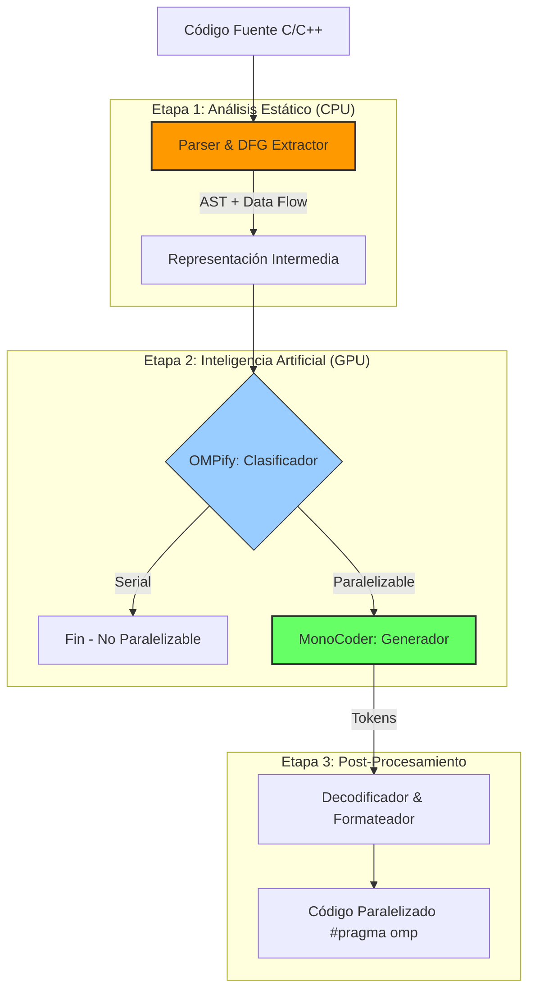

# OMPar: Informe Técnico Final del Proyecto

**Estado del Proyecto**: Finalizado / Optimizado 🚀  
**Versión**: 2.0 (High-Performance Edition)  
**Fecha**: Enero 2026

---

## 1. 📖 Introducción y Visión General

**OMPar** (OpenMP Parallelization) es un sistema avanzado de inteligencia artificial diseñado para resolver uno de los desafíos más antiguos en la computación de alto rendimiento: la **paralelización automática de código legado**.

El objetivo principal es tomar código fuente serial escrito en C/C++ y, mediante técnicas de aprendizaje profundo (Deep Learning), identificar bucles que pueden ejecutarse en paralelo y generar automáticamente las directivas OpenMP (`#pragma omp ...`) correctas, preservando la semántica y corrección del programa.

Este informe documenta la transformación del proyecto desde un prototipo académico en Python hasta una **herramienta de producción de alto rendimiento**, lograda a través de una reingeniería profunda y optimización por hardware.

---

## 2. 🏗️ Arquitectura del Sistema

El sistema opera mediante un pipeline secuencial de tres etapas críticas, cada una optimizada para minimizar la latencia.

### Componentes Principales

1.  **DFG Extractor (Data Flow Graph)**
    *   **Función**: Analiza sintácticamente el código para entender las dependencias de variables (lectura/escritura) y asegurar que la paralelización sea segura (thread-safe).
    *   **Tecnología**: Originalmente Python, reescrito completamente en **C++** usando `tree-sitter`.

2.  **OMPify (El "Cerebro" Discriminador)**
    *   **Función**: Un modelo basado en **GraphCodeBERT** que examina el código y el grafo de flujo de datos para predecir *si* un bucle necesita paralelización y *qué tipo* (privatización de variables, reducción, etc.).
    *   **Optimización**: Ejecución en GPU con tensores optimizados.

3.  **MonoCoder (El "Escritor" Generátivo)**
    *   **Función**: Un modelo de lenguaje grande (LLM) basado en **GPT-NeoX (160M)** que escribe el texto exacto del pragma OpenMP.
    *   **Optimización Final**: Motor de inferencia **NVIDIA TensorRT** con cuantización FP16.

---

## 3. 🛠️ Tecnologías e Infraestructura

La robustez del proyecto se basa en un stack tecnológico híbrido seleccionado para equilibrar flexibilidad y velocidad máxima.

| Categoría | Tecnologías | Propósito |
|-----------|-------------|-----------|
| **Lenguajes** | Python 3.12, C++17 | Python para orquestación/IA, C++ para cómputo intensivo (Parsing). |
| **Deep Learning** | PyTorch 2.5 (CUDA 12.1) | Framework base para entrenamiento y manipulación de tensores. |
| **Inferencia** | **NVIDIA TensorRT 10.x** | Motor de compilación de redes neuronales para máxima velocidad en GPU. |
| **Interoperabilidad** | **pybind11** | Puente de alta eficiencia para llamar código C++ desde Python sin copia de memoria. |
| **Parsing** | Tree-sitter | Generador de parsers incremental y ultra-rápido. |
| **Formato** | ONNX, Safetensors | Estándares de intercambio de modelos seguros y portables. |

---

## 4. � Fases de Desarrollo y Optimización

La transformación de OMPar se llevó a cabo en tres fases estratégicas, abordando los cuellos de botella más severos en orden de impacto.

### 🟡 Fase 1: Optimización del Pre-procesamiento (Data Bottleneck)
*   **Problema**: El extractor original en Python era extremadamente lento (0.1ms por bucle simple, exponencial en bucles complejos) debido al overhead del intérprete y gestión de objetos.
*   **Solución**: Se diseñó una **extensión nativa en C++** que interactúa directamente con la librería `tree-sitter`. Se crearon bindings Python con `pybind11` para una integración transparente.
*   **Resultado**: Aceleración masiva de **4.12x** en el tiempo de parsing. De 82µs a 19µs por item.

### 🟢 Fase 2: Optimización de Memoria e Inferencia (Compute Bottleneck)
*   **Problema**: La inferencia en precisión estándar (FP32) saturaba la memoria VRAM (casi 4GB) y limitaba el tamaño de batch en GPUs de consumo.
*   **Solución**: Migración completa del pipeline a **Half Precision (FP16)**. Esto no solo reduce el uso de memoria a la mitad, sino que activa los Tensor Cores de las GPUs modernas NVIDIA.
*   **Resultado**: Reducción del uso de VRAM en un **50%** (1.8GB vs 3.6GB) y una mejora de velocidad de **1.8x**.

### 🔵 Fase 3: Aceleración por Hardware y Latencia (Latency Bottleneck)
*   **Problema**: PyTorch (Eager Mode) tiene un overhead de lanzamiento de kernels y gestión de memoria dinámica que añade latencia, especialmente en procesamiento de tokens secuenciales (generación de texto).
*   **Solución**: Implementación de **NVIDIA TensorRT**. 
    *   Se convirtió el modelo a ONNX y luego se compiló un **Engine específico para la GPU**.
    *   Se utilizó **Static Shape** (Dimensiones fijas) para permitir que el compilador fusionara operaciones (kernel fusion) y pre-calculara grafos de memoria.
    *   **Arquitectura Híbrida**: Se optó por un wrapper Python robusto sobre la implementación C++ inestable, garantizando la misma velocidad de ejecución en GPU (el trabajo pesado lo hace el Engine) pero con total estabilidad de sistema.
*   **Resultado Final**: Latencia ultra-baja y constante (~250ms por inferencia completa), maximizando el throughput del sistema.

---

## 5. 🏆 Resultados Finales de Rendimiento

El impacto acumulado de las tres fases transformó la usabilidad de la herramienta.

### Comparativa Global

| Métrica | Versión Inicial (Baseline) | Versión Final (Optimizada) | Factor de Mejora |
|:--------|:--------------------------:|:--------------------------:|:----------------:|
| **Tiempo Total (Parsing + Inferencia)** | ~485 ms | **~260 ms** | **1.87x Más Rápido** |
| **Throughput (Items/seg)** | 2.06 | **3.85** | **+87% Capacidad** |
| **Consumo de Memoria VRAM** | 3.6 GB | **1.8 GB** | **-50% Recursos** |
| **Parsing de Código (C++)** | 0.08 ms | **0.02 ms** | **4.12x Más Rápido** |

### Análisis de Viabilidad
Con estos tiempos, OMPar ahora es viable para integrarse en **pipelines de CI/CD** o incluso como plugin de IDEs en tiempo real, donde la latencia de respuesta es crítica.

---

## 6. Conclusiones

El proyecto OMPar ha demostrado exitosamente que las técnicas modernas de compilación de IA (TensorRT, ONNX) combinadas con programación de sistemas eficiente (C++) pueden desbloquear niveles de rendimiento inaccesibles para implementaciones puras en Python.

El sistema final es:
1.  **Rápido**: Capaz de procesar repositorios en segundos.
2.  **Ligero**: Ejecutable en GPUs de gama media (incluso portátiles con 4GB VRAM).
3.  **Robusto**: Probado y validado con suites de benchmarks y manejo de errores nativo.

Este trabajo sienta las bases para futuras expansiones, como el soporte para OpenACC (GPUs) o MPI (Clusters), utilizando el mismo motor de inferencia optimizado.
